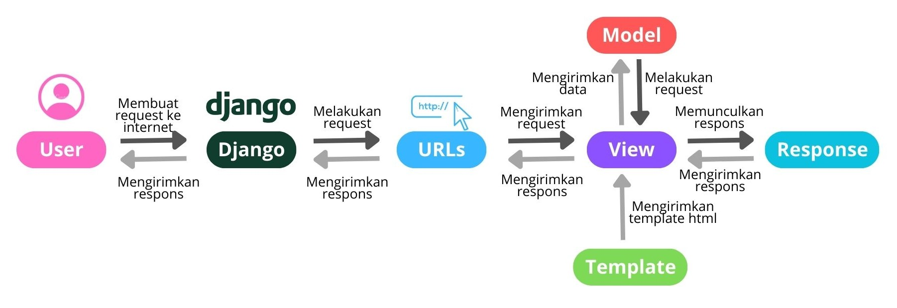

tautan menuju aplikasi PWS yang sudah di-deploy: http://rizki-hidayatul-icecreamy.pbp.cs.ui.ac.id/

TUGAS 2

1. Jelaskan bagaimana cara kamu mengimplementasikan checklist di atas secara step-by-step (bukan hanya sekadar mengikuti tutorial).
   - Hal pertama yang saya lakukan adalah membuat sebuah direktori utama lokal yang diberi nama ice_creamy. 
   - Kemudian, saya membuat dan mengaktifkan virtual environment.
   - Setelah itu, saya membuat file requirements.txt yang diisi dengan beberapa dependencies dan melakukan instalasi terhadap dependencies tersebut.
   - Kemudian saya meng-Setup Proyek Django. Melakukan instalasi django dan membuat project ice_creamy dengan perintah 'django-admin startproject ice_creamy'. 
   - Menambahkan Berkas .gitignore yang digunakan sebagai konfigurasi pada repositori git untuk memilah berkas apa saja yang perlu diabaikan ketika nanti dipush
   - Setting Github dengan nama seperti direktori sebelumnya yaitu ice_creamy. Kemudian saya menginisiasi direktori lokal ice_creamy sebagai repositori git. Setelah itu melakukan add, commit, dan push dari direktori lokal
   - Langkah selanjutnya yaitu membuat Aplikasi Django dengan nama 'main' dan mendaftarkan aplikasi di 'settings.py' agar Django dapat mengenali aplikasi tersebut.
   - Setelah membuat aplikasi django, saya membuat berkas template html, lalu mengisinya dengan berkas main.html
   - Membuat Model. Mengubah berkas 'models.py' sesuai dengan ketentuan soal. 
   - Setelah itu, melakukan migrasi model agar perubahan model yang terjadi dapat diketahui oleh server.
   - Kemudian, membuat views. Melakukan integrasi model, views, dan template pada berkas 'views.py'. Fungsinya untuk mengatur http agar dapat mengembalikan tampilan yang sesuai. Lalu melakukan modifikasi pada template agar dapat menampilkan data.
   - Melakukan routing URL. Menambahkan 'urls.py' pada direktori main agar dapat mengambil modul main views sebagai tampilan ketika mengakses url. 
   - Terakhir, saya mengecek website saya melalui local host dengan menjalankan server django. Kebetulan tidak terjadi error, sehingga saya tidak perlu melakukan trouble shooting. ><

2. Buatlah bagan yang berisi request client ke web aplikasi berbasis Django beserta responnya dan jelaskan pada bagan tersebut kaitan antara urls.py, views.py, models.py, dan berkas html.

Bagan di atas merupakan konsep dan arsitektur MVT pada django. User mengirim request ke internet dan internet meneruskan request tersebut kepada file django untuk komponen2 MVT ini.
M: Model:  mengatur dan mengelola seluruh data pada aplikasi. Model mewakili struktur data dan logika aplikasi di belakang tampilan web.
V: View: view mengontrol bagaimana data yang dikelola oleh model dapat ditampilkan kepada user. Ini merupakan komponen yang menangani logika presentasi dalam konsep MVT
T: Template: mengatur tampilan interface pengguna dengan memisahkan kode HTML dari loika aplikasi. 

3. Jelaskan fungsi git dalam pengembangan perangkat lunak!
Menurur dcloud.co.id, git merupakan software debelopment yang berfungsi sebagai sistem kontrol versi (version control system) untuk menyimpan, mengelola, dan berbagi kode sumber secara efisien dan kolaboratif. Menurut pengalaman saya, penggunaan git berfungsi agar dapat melacak perubahan kode proyek yang dibuat programmer. Selain itu, penggunaan git memungkinkan developer bekerja secara kolaboratif dalam tim. 
sources:https://dcloud.co.id/blog/apa-itu-git.html#:~:text=Git%20adalah%20alat%20software%20development,code)%20secara%20efisien%20dan%20kolaboratif. 

4. Menurut Anda, dari semua framework yang ada, mengapa framework Django dijadikan permulaan pembelajaran pengembangan perangkat lunak?
Menurut sumber belajar pbp di scele, ada beberapa alasan django dijadikan permulaan pembelajaran pengembangan software, yaitu:
- Open sources: siapapun dapat mengakses, memodifikasi, dan mendistribusikan kode secara gratis. Ini membuat django mudah diakses bagi para pelajar yang ingin mulai belajar tanpa memerlukan biaya lisensi
- Ridiculously Fast: Django dirancang untuk membantu pengembang membangun aplikasi web dengan cepat. Sehingga menjadikan django ramah bagi pemula.
- Fully loaded: django memiliki banyak fitur bawaan seperti sistem autentikasi, manajemen konten admin, ORM (Object-Relational Mapping) untuk database, dan lainnya.
- Reassuringly secure: Framework django dilengkapi dengan perlindungan terhadap serangan umum seperti  SQL injection, cross-site scripting (XSS), dan cross-site request forgery (CSRF)
- Exceedingly Scalable: aplikasi yang dibangun dengan Django dapat dengan mudah menangani peningkatan trafik pengguna atau kompleksitas fitur seiring dengan pertumbuhan aplikasi. Hal ini menjadikan django ideal untuk belajar sekaligus memungkinkan ekspansi aplikasi tanpa harus mengganti framework.
- Incredibly Versatile: Django sangat serbaguna dan dapat digunakan untuk berbagai jenis aplikasi web. Fleksibilitas ini memungkinkan untuk bereksperimen dengan berbagai tipe aplikasi web tanpa harus mempelajari framework baru.
sources: https://revou.co/kosakata/django , https://www-netguru-com.translate.goog/blog/django-apps-examples?_x_tr_sl=en&_x_tr_tl=id&_x_tr_hl=id&_x_tr_pto=tc (+dibantu chatgpt)

5. Mengapa model pada Django disebut sebagai ORM?##
Model pada Django disebut sebagai ORM (Object-Relational Mapper) karena Django menggunakan ORM untuk mempermudah interaksi antara kode Python dan basis data. Dalam ORM Django, data dari basis data diubah menjadi objek Python, yang lebih mudah dimanipulasi. Ini berarti bahwa tabel dan kolom dalam database dipetakan menjadi kelas dan atribut Python, sehingga kita dapat melakukan operasi database seperti menyimpan, mengambil, memperbarui, atau menghapus data hanya dengan menggunakan sintaks Python, tanpa perlu menulis SQL secara eksplisit.
sources: https://sohaibanser.medium.com/django-orm-pros-and-cons-8ab069598c1b 

TUGAS 3

1. Jelaskan mengapa kita memerlukan data delivery dalam pengimplementasian sebuah platform?
Data delivery diperlukan dalam implementasi sebuah platform karena memungkinkan pertukaran informasi/data antara server dengan pengguna (seperti aplikasi web atau mobile). Pada umumnya, platform terdiri dari beberapa begian yang saling terhubung dan berkomunikasi. Data Delivery digunakan agar setiap bagian ini dapat saling berkomunikasi.
Misalnya, ketika user mengirimkan informasi/data (misalnya mengisi form), server akan menerima, memproses, lalu mengirimkan respons kepada pengguna. Tanpa adanya data delivery, setiap bagian pada platform tidak dapat bekerja dengan optimal karena tidak dapat berbagi informasi.
Selain itu, data delivery mempunyai peran penting dalam implementasi sebuah platform, diantaranya yaitu:
- Real-time data delivery, dimana memungkinkan pengguna dapat selalui melihat pembaruan data terbaru secara real time.
- User experience yang responsif dan akurat, karena dengan data delivery, user dapat mengakses informasi secara real-time dan akurat.
- Integrasi Data. Data delivery yang efektif memastikan bahwa komunikasi antara platform dengan sistem lain berjalan dengan lancar.
- Keamanan data: Data delivery yang baik mencakup enkripsi dan perlindungan data saat dalam proses pengirimannya.
  
2. Menurutmu, mana yang lebih baik antara XML dan JSON? Mengapa JSON lebih populer dibandingkan XML?
Menurut saya, JSON lebih baik dari pada XML. Alasan mengapa JSON lebih populer menurut saya yaitu:
- Syntax yang lebih simple.  JSON memiliki struktur yang lebih ringkas daripada XML.  JSON menggunakan kurung kurawal {} untuk objek dan tanda kurung siku []untuk array, yang membuatnya ringkas dan jelas. Sebaliknya, XML menggunakan tag pembuka dan penutup seperti <tag></tag>, yang membuatnya lebih panjang dan tidak seefisien JSON.
- Ukuran JSON lebih kecil. Karena sytax yang lebih sederhana dan simple, file JSON biasanya lebih kecil ukurannya dari pada xml. Sehingga, pengiriman data lebih cepat dan hemat bandwidth. Dalam pengembangan aplikasi web dan mobile, sering kali bekerja dengan data dalam jumlah besar, sehingga hal ini menjadi perlu diperhatikan.
- Kemudahan dalam Parsing. Parsing dalam JSON dapat dilakukan parsing menggunakan fungsi JavaScript standar. Sedangkan parsing XML harus dengan parser XML, dimana dapat memperlambat dan mempersulit prosesnya. Hal ini juga mempengaruhi waktu dalam memproses data, dimana JSON akan lebih cepat dari pada XML.
- Selain itu, JSON juga lebih kompatibel dengan banyak bahasa pemrograman sehingga bagus untuk digunakan dalam banyak platform
source: https://www.directual.com/blog/json-and-xml-which-one-is-better-for-no-coders

3. Jelaskan fungsi dari method is_valid() pada form Django dan mengapa kita membutuhkan method tersebut?

Kita memerlukan method is_valid() pada form Django untuk memvalidasi/memeriksa apakah data yang dikirimkan melalui form sudah benar sesuai aturan yang ditentukan. Jika datanya valid, is_valid() akan mengembalikan True dan menyediakan data yang bersih (cleaned data) untuk diproses lebih lanjut. Hal ini diperlukan agar aplikasi hanya menerima data yang benar (yang sudah diproses oleh method is_valid) sebelum di proses, seperti disimpan ke database. Hal ini dapat mencegah kesalahan atau masalah keamanan.

4. Mengapa kita membutuhkan csrf_token saat membuat form di Django? Apa yang dapat terjadi jika kita tidak menambahkan csrf_token pada form Django? Bagaimana hal tersebut dapat dimanfaatkan oleh penyerang?

csrf_token dibutuhkan saat membuat form di Django karena csrf_token penting untuk menlindungi dari serangan CSRF (Cross-Site Request Forgery). csrf_token bekerja dengan memastikan setiap permintaan yang adamodifikasi data berasal dari sumber yang benar. Tanpa validasi csrf_token, aplikasi Django tidak bisa membedakan antara permintaan dari pengguna dan permintaan berbahaya dari pihak ketiga. Dengan hal ini, aplikasi menjadi lebih aman dari serangan yang memanfaatkan user session yang sah tanpa sepengatahuan user.
source: https://www.geeksforgeeks.org/csrf-token-in-django/ 

5. Jelaskan bagaimana cara kamu mengimplementasikan checklist di atas secara step-by-step (bukan hanya sekadar mengikuti tutorial).

Pada tugas ini, saya diminta untuk membuat input form dan menambahkan 4 fungsi views baru untuk melihat objek yang sudah ditambahkan dalam format XML, JSON, XML by ID, dan JSON by ID, serta membuat routing URL di masing-masing views.
Berikut langkah-langkah yang saya kerjakan:

a. Membuat forms.py di direktori main untuk membuat form input data Product menggunakan field ['name', 'price', 'description', 'quantity', 'stock', 'rating'].

b. Implementasi fungsi create_product pada views.py untuk menampilkannya di template HTML.
Saya melakukan import forms yang baru dibuat dengan menambahkan import redirect. Saya lalu membuat fungsi baru yaitu create_product untuk melakukan validasi input form dan menambahkan data yang ditambah user pada form. Selanjutnya, pada fungsi show_main, saya menambahkan kode Product.object.all() untuk mengambil semua objek dari model Product yang ada pada database. Nilai ini kemudian disimpan pada variable products dan dimasukkan ke context, lalu dikirimkan ke HTML agar dapat ditampilkan pada website.

c. Melaukan routing URL
Hal ini dilakukan dengan mengimport fungsi create_product pada urls.py dan menambahkan path untuk mengakses fungsi create_product.

d. Membuat tampilan pada template HTML.
Ini dilakukan dengan membuat file html baru, yaitu create_product.html pada direktori main/templates. <form method = "POST"> ditambahkan untuk menandakan block untuk form yang menggunakan metode POST. Selain itu, ditambah juga  yang fungsinya dijelaskan pada no 4 di atas.

e. Membuat 4 fungsi untuk mengembalikan data dalam bentuk XML dan JSON, yaitu show_xml, show_json, show_xml_by_id, dan show_json_by_id di file views.py.

f. Melakukan routing URL di masing-masing views. Hal ini dilakukan dengan Menambahkan path untuk menampilkan page yang dapat melihat database.

g. Add, commit, dan push ke github untuk menyimpan perubahan.

##Dokumentasi Postman##

TUGAS 4

1. Apa perbedaan antara HttpResponseRedirect() dan redirect()?
   
Dalam Django, HttpResponseRedirect() dan redirect() digunakan untuk mengirim user ke URL yang berbeda, tetapi ada beberapa perbedaan kecil antara keduanya: 

Dari segi return type, `HttpResponseRedirect()` secara langsung menghasilkan objek HTTP response yang melakukan pengalihan ke URL yang ditentukan. Sementara itu, `redirect()` adalah fungsi shortcut yang juga return sebagai `HttpResponseRedirect()`, namun lebih fleksibel dalam menerima berbagai jenis argumen. Selan itu, `redirect()`dapat menerima URL, nama view, atau instance model.

Dari segi parameter, penggunaan `redirect()` memungkinkan penggunaan positional dan named parameters yang nantinya digunakan untuk membentuk URL. Jadi, cukup dengan memberikan nama view atau URL tujuan, Django akan otomatis mengonversinya menjadi URL yang sesuai. Hal ini sangat berguna saat bekerja dengan namespace atau nama view, seperti pada contoh `redirect('main:show_main')`.
Sehingga dapat disimpulkan bahwa:
-	Gunakan HttpResponseRedirect() jika ingin melakukan redirect secara manual menggunakan URL tertentu. 
-	Gunakan redirect() jika ingin memanfaatkan shortcut yang lebih fleksibel dan dapat menangani URL, view name, atau objek model secara otomatis.

2. Jelaskan cara kerja penghubungan model Product dengan User!

Untuk menghubungkan model `Product` dengan `User` di Django, diperlukan relasi *foreign key* pada model `Product` yang merujuk ke model `User`. `ForeignKey` digunakan untuk membangun hubungan satu-ke-banyak (*one-to-many*) antara `Product` dan `User`, di mana seorang pengguna dapat memiliki beberapa produk. Pengaturan `on_delete=models.CASCADE` berarti ketika pengguna dihapus, semua produk yang terkait dengan pengguna tersebut juga akan ikut dihapus. Misalnya, hal ini bisa diimplementasikan dengan menambahkan `user = models.ForeignKey(User, on_delete=models.CASCADE)` di file `models.py`.

3. Apa perbedaan antara authentication dan authorization, apakah yang dilakukan saat pengguna login? Jelaskan bagaimana Django mengimplementasikan kedua konsep tersebut!
 
- Authentication : 
Proses untuk memverifikasi identitas pengguna. Ini bertujuan memastikan bahwa pengguna adalah siapa yang mereka klaim. Pada prosesnya, biasanya melibatkan pengguna memasukkan kredensial seperti username dan password, atau metode lain seperti otentikasi dua faktor (2FA). Contoh: Saat pengguna login, mereka memasukkan username dan password. Jika cocok dengan data di sistem, pengguna dianggap berhasil diautentikasi.
- Authorization :
Proses untuk menentukan hak akses pengguna yang telah terotentikasi. Ini menentukan apa yang diizinkan untuk dilakukan pengguna dalam sistem. Setelah pengguna terotentikasi, sistem memeriksa izin atau peran mereka untuk memastikan akses ke fitur atau data tertentu. Contohnya, setelah login, meskipun pengguna berhasil diautentikasi, mereka mungkin hanya diizinkan mengakses halaman tertentu berdasarkan peran mereka (seperti admin, user biasa, atau guest).
 
Dalam implementasi Django, *authentication* terjadi ketika pengguna login menggunakan *authentication views* bawaan Django. Kredensial yang dimasukkan oleh pengguna akan diperiksa dengan mencocokkannya ke database. Jika kredensial tersebut valid, Django akan membuat sesi (session) untuk pengguna, yang menyimpan informasi login mereka agar dapat dikenali dalam interaksi berikutnya.
Di sisi lain, **authorization** dikelola menggunakan *permission classes* dan *decorators*. Misalnya, dengan menerapkan dekorator `@login_required`, Django memastikan bahwa hanya pengguna yang sudah terautentikasi yang dapat mengakses view tertentu. Ini berarti pengguna harus login terlebih dahulu sebelum dapat mengunjungi halaman-halaman yang dilindungi. Selain itu, Django juga mendukung izin berbasis peran atau tingkat akses lainnya, yang memungkinkan kontrol lebih lanjut terhadap hak akses pengguna dalam aplikasi.

4. Bagaimana Django mengingat pengguna yang telah login? Jelaskan kegunaan lain dari cookies dan apakah semua cookies aman digunakan?
   
Django mengingat pengguna yang telah login dengan menggunakan cookies dan sessions. Saat pengguna berhasil login, Django membuat cookie khusus di browser pengguna yang menyimpan informasi tentang sesi mereka. Cookie ini berisi session ID, yang menjadi penghubung antara pengguna dan data session yang disimpan di server. Selama sesi ini aktif, setiap kali pengguna mengirimkan permintaan (request) ke server, Django memeriksa session ID yang terdapat dalam cookie tersebut untuk mengetahui identitas pengguna dan mengingat status login mereka. Seperti misalnya pada tugas saya, cookie waktu user terakhir login dibuat dan ditampilkan pada website.

Selain itu, Django juga memanfaatkan sesi (session) untuk mengingat pengguna yang telah berhasil login. Setelah login sukses, Django akan melakukan hal berikut:
- Membuat session: Sebuah sesi dihasilkan di sisi server, dan sebuah identifier atau session ID disimpan dalam cookie di browser pengguna.
- Cookie manajemen: Cookie memungkinkan Django untuk mengidentifikasi user yang kembali tanpa memerlukan mereka untuk log in kembali sebelum session mereka expire atau user melakukan log out.
  
Selain untuk mengingat pengguna yang login, cookies memiliki berbagai kegunaan lain, seperti:

a.	Menyimpan preferensi pengguna. 
Cookies dapat menyimpan preferensi pengguna seperti tema warna, bahasa, atau pengaturan lainnya, sehingga pengguna tidak perlu mengatur ulang setiap kali mengunjungi situs

b.	Pelacakan aktivitas pengguna. 
Cookies sering digunakan oleh aplikasi atau situs web untuk melacak aktivitas pengguna, seperti halaman apa saja yang telah dikunjungi. Sehingga website dapat memberikan pengalaman yang lebih personal atau untuk tujuan pemasaran

Apakah semua cookies aman? Tidak semua cookies aman digunakan. Ada beberapa hal yang perlu diperhatikan terkait keamanan cookies:

a.	Cookies tanpa enkripsi: Cookies yang tidak dienkripsi (HTTP cookies) rentan terhadap serangan man-in-the-middle (MITM). Informasi sensitif, seperti session ID, sebaiknya disimpan dalam cookies yang terenkripsi menggunakan HTTPS.

b.	Cookies tidak aman: Jika cookies tidak diberi atribut Secure, mereka dapat dikirimkan melalui koneksi HTTP yang tidak aman. Django memungkinkan pengaturan ini untuk memastikan cookies hanya dikirimkan melalui HTTPS dengan menambahkan opsi SESSION_COOKIE_SECURE = True.

c.	Cookies yang rentan terhadap serangan XSS: Cookies dapat menjadi target serangan Cross-Site Scripting (XSS). Untuk mengurangi risiko ini, Django mendukung atribut HttpOnly yang memastikan cookies tidak dapat diakses melalui JavaScript, dan SameSite untuk menghindari pengiriman cookies lintas situs yang tidak sah.

d.	Masa berlaku cookies: Cookies yang memiliki masa berlaku terlalu panjang dapat menimbulkan risiko keamanan. Misalnya, jika seseorang mendapatkan akses ke perangkat pengguna, mereka bisa menggunakan cookies yang masih valid untuk menyamar sebagai pengguna tersebut.

Dengan langkah-langkah pengamanan yang tepat, seperti menggunakan atribut Secure, HttpOnly, dan SameSite, serta mengirim cookies hanya melalui HTTPS, risiko keamanan cookies dapat diminimalisir.

5. Jelaskan bagaimana cara kamu mengimplementasikan checklist di atas secara step-by-step (bukan hanya sekadar mengikuti tutorial).

Pada tugas ini saya dimimnta untuk menimplementasikan Autentikasi, Session, dan Cookies pada Django.
Berikut langkah yang saya lakukan:
1. Membuat Form Registrasi: Menggunakan `UserCreationForm` untuk membuat form registrasi pengguna baru dan menambahkan fungsi `register` di `views.py` untuk menangani logika registrasi.
2. Membuat Interface: Membuat template `register.html` sebagai tampilan interface untuk registrasi, serta menambahkan URL-nya di `urls.py` agar halaman registrasi dapat diakses.
3. Menambahkan Fungsi Login: Menambahkan fungsi `login_user` di `views.py` untuk menangani proses login, membuat template `login.html` untuk tampilan login, dan menambahkan URL login di `urls.py`.
4. Menambahkan Fungsi Logout: Menambahkan fungsi `logout_user` di `views.py` untuk menangani logout, button logout di `main.html`, serta URL logout di `urls.py`.
5. Membuat Restriksi Login: Menambahkan logika yang membatasi akses ke produk-produk tertentu hanya untuk pengguna yang telah login, sehingga hanya pemilik akun yang dapat melihat produk mereka.
6. Pengaturan Cookies: Menggunakan cookies untuk melacak aktivitas login terakhir pengguna (*last login*) dan menghubungkan model `Product` dengan `User`.
7. Migrate: Setelah semua langkah selesai, migrasi dibuat dan diuji dengan menjalankan server lokal. 
8. Push kode ke GitHub.

TUGAS 5
1. Jika terdapat beberapa CSS selector untuk suatu elemen HTML, jelaskan urutan prioritas pengambilan CSS selector tersebut!

-	Inline styles: Gaya yang langsung diterapkan pada elemen HTML melalui atribut style.
   Contoh:
    

-	IDs: Selector yang menggunakan ID elemen, ditulis dengan symbol
   Contoh:
    #myId { color: red; }
-	Classes, Attributes, dan Pseudo-classes: Selector yang menggunakan class (.className), atribut ([attribute=value]), atau pseudo-class seperti :hover dan :focus
   Contoh:
   .myClass { color: red; }
-	Elements dan Pseudo-elements: Selector yang menggunakan nama tag HTML (seperti div, p) atau pseudo-element seperti ::before dan ::after
   Contoh:
   myClass { color: red; }
-	Universal Selector -> Selector universal (*), yang diterapkan untuk semua elemen, dan memiliki prioritas paling rendah.
   Contoh:
   { margin: 0; }

   
2. Mengapa responsive design menjadi konsep yang penting dalam pengembangan aplikasi web? Berikan contoh aplikasi yang sudah dan belum menerapkan responsive design!
Menurut saya, responsive desain menjadi konsep yang penting dalam web development karena dengan ini, memmungkinkan sebuah web untuk menyesuaikan UI nya dengan berbagai ukuran layer, mulai dari layer handphone, pc, tab ataupun laptop. Dengan responsive design, kita dapat meningkatkan user experience yang kita berikan seperti memudahkan user membaca suatu informasi. Selain itu, responsive design juga dapat meningkatkan pengoptimalisasian search engine, karena memiliki satu URL untuk semua device, hal ini akan menguntungkan karena Google memprioritaskan mobile-friendly website untuk ranking website mereka. Selain itu dari sisi developer, responsive design satu set kode dapat digunakan untuk semua perangkat, sehingga dapat mempercepat kinerja dan kecepatan kerja.

Contoh aplikasi yang sudah menerapkan responsive design: https://aws.amazon.co, https://shopee.co.id/, youtube.com, dll (biasanya aplikasi besar yang sudah punya kredibilitas). 
Contoh aplikasi yang belum menerapkan responsive design:
https://main.semarangkab.go.id/ , 'https://jatengprov.go.id/'

3. Jelaskan perbedaan antara margin, border, dan padding, serta cara untuk mengimplementasikan ketiga hal tersebut!

Margin, border, dan padding adalah tiga properti CSS yang digunakan untuk mengatur ruang di sekitar elemen HTML.

1.	Margin:
Margin adalah ruang kosong di luar batas (border) elemen. Properti ini digunakan untuk memberikan jarak antar elemen yang berbeda di halaman. Ketika margin diatur, elemen akan tampak lebih terpisah dari elemen-elemen di sekitarnya. Misalnya, margin: 10px; akan menambahkan jarak 10 piksel di luar batas elemen dari setiap sisi (atas, kanan, bawah, dan kiri). Nilai margin dapat diatur per sisi dengan margin-top, margin-right, margin-bottom, dan margin-left, atau menggunakan penulisan singkat (shorthand) seperti margin: 10px 15px; yang berarti jarak 10 piksel untuk sumbu vertikal (atas dan bawah) dan 15 piksel untuk sumbu horizontal (kanan dan kiri).

2.	Border:
Border adalah garis yang mengelilingi elemen, berfungsi untuk membatasi elemen dari ruang di sekitarnya. Border bisa dikustomisasi dengan properti ketebalan (border-width), gaya garis (border-style), dan warna (border-color). Misalnya, border: 2px solid black; berarti elemen tersebut akan memiliki garis batas berketebalan 2 piksel, dengan gaya garis solid (garis lurus tanpa pola), dan berwarna hitam. Border juga bisa diterapkan pada setiap sisi secara terpisah, misalnya dengan border-top, border-right, border-bottom, dan border-left. Selain itu, border dapat dikreasikan dengan berbagai gaya seperti dotted, dashed, double, atau groove untuk menambah variasi visual.

3.	Padding:
Padding adalah ruang di dalam elemen, antara konten utama (teks atau gambar) dan garis batas (border) elemen. Padding membantu mengatur jarak antara konten dengan tepi elemen, sehingga membuat konten terlihat lebih rapi dan tidak terlalu mepet dengan batas elemen. Misalnya, padding: 10px; berarti memberikan jarak 10 piksel di dalam elemen dari setiap sisi. Sama seperti margin, padding juga bisa diatur per sisi, seperti padding-top, padding-right, padding-bottom, dan padding-left. Nilai padding mempengaruhi ukuran elemen secara keseluruhan, karena menambah ruang di dalam elemen.
Secara visual, urutannya adalah sebagai berikut:
Margin (paling luar) → Border → Padding → Konten (paling dalam).

4. Jelaskan konsep flex box dan grid layout beserta kegunaannya!
Flexbox dan Grid Layout adalah dua metode layout CSS yang dirancang untuk mempermudah pengaturan tata letak elemen di halaman web, masing-masing dengan tujuan dan kegunaan yang berbeda.

Flexbox (Flexible Box Layout):
Flexbox adalah metode tata letak satu dimensi yang berfungsi untuk mengatur elemen dalam satu baris (horizontal) atau satu kolom (vertikal). Dengan menggunakan flexbox, developer dapat dengan mudah mengatur ukuran, orientasi, dan distribusi ruang antar elemen, termasuk menentukan seberapa besar elemen tertentu dibanding elemen lainnya. Flexbox sangat berguna untuk membangun tata letak yang responsif, seperti menu navigasi, baris tombol, atau daftar item, karena elemen di dalam flex container dapat beradaptasi dengan ukuran layar yang berbeda.

Grid Layout:
Grid Layout adalah metode tata letak dua dimensi yang memungkinkan pengaturan elemen dalam baris dan kolom sekaligus. Berbeda dengan flexbox, Grid Layout memberikan kontrol yang lebih detail untuk menyusun elemen-elemen dalam pola yang kompleks, seperti layout halaman web dengan header, sidebar, konten utama, dan footer. Grid Layout memungkinkan pembagian area atau ruang yang lebih fleksibel, mendukung pembuatan grid responsif yang dapat beradaptasi dengan ukuran layar. Grid Layout cocok untuk struktur yang lebih kompleks, seperti galeri gambar atau halaman dengan banyak konten.
 
5. Jelaskan bagaimana cara kamu mengimplementasikan checklist di atas secara step-by-step (bukan hanya sekadar mengikuti tutorial)!
Yang saya lakukan di tahap awal adalah dengan membuat fitur edit product dan delete product. Fitur edit product saya lakukan dengan cara membuat fungsi edit_product pada views.py dan menambahkan path url edit product pada url patterns di urls.py. Begitupun untuk fitur delete, dengan membuat fungsi delete_product yang menerima parameter request dan id pada views.py lalu menambahkan path url delete product pada url patterns di urls.py.
Selanjutnya saya membuat file html untuk fitur yang saya buat sebelumnya, yaiut fitur edit product. Selanjutnya saya juga membuat file html untuk navigation bar.
Setelah itu, saya melakukan konfigurasi  static files pada settings.py dengan menambahkan middleware WhiteNoise dan mengonfigurasikan STATIC_ROOT, STATICFILES_DIRS, dan STATIC_URL.
Setelah elemen yang diperlukan sudah memiliki fungsionalitas, selanjutnya saya menambahkan styles dengan Tailwind. Hal ini saya lakukan dengan menambahkan folder static yang berisi global.css dan script tailwind ke base.html
Langkah selanjutnya yang saya lakukan yaitu melakukan styling pada halaman2 html yang sudah saya buat baik di template pada main, juga pada template di main direktori. Tak lupa, saya juga membuat file styling untuk card informasi produk serta info pengguna.

Langkah yang teakhir yaitu memastikan semua fungsi berfungsi dengan baik, dan memiliki ux yang baik juga.
Terakhir, melakukan push ke github dan pws.

